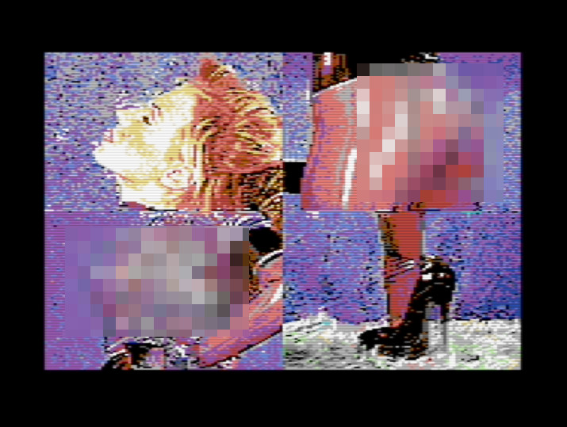

# HypraFap - Retro Fapping System

for the Commodore 64

How would your *digital* adult image collection have been looked in the 1980s?

Ever wondered how your *pron* stash would have looked on floppy disk?

Try it out with HypraFap!

With HypraFap you can store and view 16 beautiful color images per disk side on your Commodore 64!

It of course works on an C64 emulator like VICE, too.

> :eggplant: :sweat_drops: *Note: All sample images on this page are censored*

# Getting started with the HypraFap Demo Disk

You can try out HypraFap with it's Demo Disk!

Install a C64 emulator like VICE:

[https://vice-emu.sourceforge.io/](https://vice-emu.sourceforge.io/)

You can download the demo disk in d64 format here:

[https://github.com/pronopython/hyprafap/raw/main/hyprafap_demo_disk.d64](https://github.com/pronopython/hyprafap/raw/main/hyprafap_demo_disk.d64)

If you are using VICE, you can Autostart the disk.

Otherwise attach the disk image and load HypraFap with

`LOAD"*",8,1`

and then start it with

`RUN`

It then loads the first image on disk, which in case of this Demo Disk is the index picture.

> :eggplant: :sweat_drops: *Note: Without any fastloader the speed is totally normal for the C64 Floppy: very slow! It takes 25 Seconds to load an image!*

The Demo Disk greets you with images of shoes (sorry no prono d64 disks on github :-) ):

Every image in HypraFap has a number or letter. See here how all the images are labled 1-9, A-F. The index you are currently seeing has the number 0.

You can press `Space` to advance to the first image (the one labled 1 in the image):

After the image is loaded, press `Space` again to advance to the next image, the shoe image with the brown background.

You can directly select an image by pressing its number/letter. Press `5` to jump to the blue image.

Press `0` or `i` (as in index) to jump back to the index image.

While loading the next screen the old image is visible and you can see how it is overwritten with new image data.
This is intentional (you know HypraFap is doing something).
This first version has no double screen buffers etc.
Load happens directly into video ram section.

See here how the next image is faintly visible on the top half (a face in the middle):

## Swap Disk

If you have multiple disks with images, you can swap a disk out anytime while no drive access happens.

Press `R` to reload the directory of the new disk and access the images on it.

# Keyboard Commands

| key | command |
|---|---|
| `0`-`9`, `A`-`F`| Load image 0..15|
| `I` | Load first image / number 0 (index / gallery)|
| `Space` | next image |
| `R` | Reload directory after disk swap. Loads first image on new disk|

# Making your own HypraFap disks

The shoe demo disk is not that exciting -- make your own disk!

## Image format

HypraFap uses standard uncompressed Koala Painter images produced by a lot of programs. I recommend Convertron 3000:

[https://github.com/fieserWolF/convertron3000](https://github.com/fieserWolF/convertron3000)

to convert `.jpg` / `.png` files to `.koa` files.

### Image aspect ratio

Note that the pixels are not perfectly square on a C64.

You get the best results when you compose your image in Photoshop or Gimp on a 320 x 214 pixel canvas and then reduce it to 160 x 200 pixels. After that blow it up again *without antialias* to 320 x 200. This then should be the version you put into Convertron 3000.

## Disk layout

To create your disk you can use tools like *cc1541*:

[https://csdb.dk/release/?id=230166](https://csdb.dk/release/?id=230166)

Under Ubuntu you can find this tool in the standard repo!

Write the content in the following order to the disk image:

1. HypraFap.prg (Download below)
2. Your index image (if any)
3. all other images

Download the latest HypraFap prg file here:
[https://github.com/pronopython/hyprafap/raw/main/hyprafap.prg](https://github.com/pronopython/hyprafap/raw/main/hyprafap.prg)

See how the Demo Disk looks like: 

Images *need* to have the name ending in `.koa` for HypraFap to recognize them!

Add up to 16 Koala images per disk!

## Index image template

Index pages are just koala pictures like all the other pictures on the disks. An index images has to be the first image in the directory with the ending `.koa`.

You can use this template for your index image:

Note that this image is 160 x 200 and *after* you added all images you need to blow it up to 320 x 200 *without* antialias.

# Fast Loader compatibility

HypraFap works with Ultraload Plus. Download Ultraload Plus from csdb:

[https://csdb.dk/release/?id=60309](https://csdb.dk/release/?id=60309)

Load Ultraload Plus and start it. After that change the disk to HypraFap and load it as usual.

Images now load within 5 seconds!

# Compile HypraFap yourself

HypraFap was written for Turbo Macro Pro Cross Assembler ("TMPx"):

[https://turbo.style64.org/](https://turbo.style64.org/)

If you have the linux bin in the same directory (src) as the `.asm` files run:

`./tmpx -i hyprafap.asm -o hyprafap.prg`

to compile HypraFap.

# Know bugs & limitations

- "Loading" message is written to screen ram, color changes in the old image partially when load is started. Since the old image is overwritten, that is not that of a problem.
- Currently there is absolutly no error handling. If something is wrong with your disk or drive or filenames or whatever, HypraFap will just crash and you will probably see a frozen C64.
- Although there's this logo screenshot on top of this page, HypraFap comes without it. No one wants to wait 25 seconds for a logo. And it takes up 10 kB on disk ;-)

# Troubleshooting

| Problem | Solution |
|---------|---|
|It is slow!| Yes, the data transfer between disk drive and computer is 400 bytes (!) per second. A 10kB Koala image takes about 25 seconds to load. You can speed this up with a fastloader, see above.|

# Release Notes

## v0.1.0-alpha

- Initial Release

# Why?

For me this is just a weekend fun project to learn a bit 6502 assembly language on an 8 bit computer :-)
