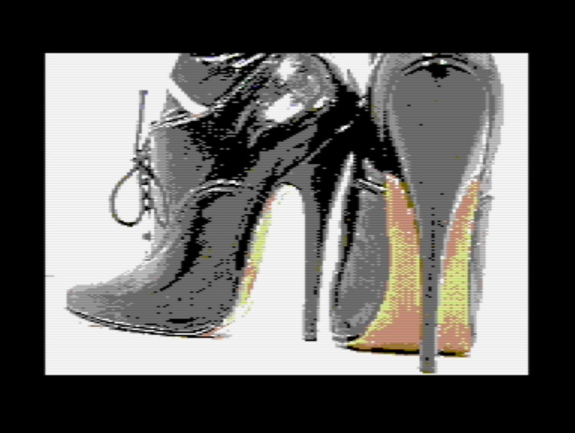

# HypraFap - Retro Fapping System

for the Commodore 64

How would your *digital* adult image collection have been looked in the 1980s?

Ever wondered how your *pron* stash would have looked on floppy disk?

Try it out with HypraFap!

With HypraFap you can store and view about 16 beautiful color images per disk side on your Commodore 64!

It of course works on an C64 emulator like VICE, too.

> :eggplant: :sweat_drops: *Note: All sample images on this page are censored*

# Getting started with the HypraFap Demo Disk

You can try out HypraFap with it's Demo Disk!

Install a C64 emulator like VICE:

[https://vice-emu.sourceforge.io/](https://vice-emu.sourceforge.io/)

You can download the demo disk in d64 format here:

[https://github.com/pronopython/hyprafap/raw/main/hyprafap_demo_disk.d64](https://github.com/pronopython/hyprafap/raw/main/hyprafap_demo_disk.d64)

If you are using VICE, you can Autostart the disk.

Otherwise attach the disk image and load HypraFap with

`LOAD"*",8,1`

and then start it with

`RUN`

It then loads the first image on disk, which in case of this Demo Disk is the index picture.

> :eggplant: :sweat_drops: *Note: Without any fastloader the speed is totally normal for the C64 Floppy: very slow! It takes 25 Seconds to load an image!*

The Demo Disk greets you with images of shoes (sorry no prono d64 disks on github :-) ):

Every image in HypraFap has a number or letter. See here how all the images are labled 1-9, A-F. The index you are currently seeing has the number 0.

You can press `Space` to advance to the first image (the one labled 1 in the image):

After the image is loaded, press `Space` again to advance to the next image, the shoe image with the brown background.

You can directly select an image by pressing its number/letter. Press `5` to jump to the blue image.

Press `0` or `i` (as in index) to jump back to the index image.

Now press `F3` to switch to the second screen and load image number 3 by pressing `3`.

You then can switch back to screen 1 (with the index) by pressing `F1`. Jump back and forth between both screens. Everytime you press an image number or space, hyprafap loads the image to the currently selected screen.

While loading the next screen the old image is visible and you can see how it is overwritten with new image data.
This is intentional (you know HypraFap is doing something).
This first version has no double screen buffers etc.
Load happens directly into video ram section.

See here how the next image is faintly visible on the top half (a face in the middle):

If you load a compressed Koala image (`.gg`), you cannot see how it is loaded because the data is loaded off screen to a buffer for decompressing.

## Swap Disk

If you have multiple disks with images, you can swap a disk out anytime while no drive access happens.

Press `R` to reload the directory of the new disk and access the images on it.

Also, when you start HypraFap as a standalone `.prg` in VICE and thus no image is loaded at startup, use `R` to switch to and load an image disk.

# Keyboard Commands

| key | command |
|---|---|
| `0`-`9`, `A`-`H`| Load image 0..17 to current screen|
| `I` | Load first image / number 0 (index / gallery) to current screen|
| `Space` | next image |
| `R` | Reload directory after disk swap. Loads first image on new disk to current screen|
| f1 | Switch to screen 1|
| f3 | Switch to screen 2|

# Making your own HypraFap disks

The shoe demo disk is not that exciting -- make your own disk!

## Image format

HypraFap uses standard uncompressed Koala Painter images produced by a lot of programs. I recommend Convertron 3000:

[https://github.com/fieserWolF/convertron3000](https://github.com/fieserWolF/convertron3000)

to convert `.jpg` / `.png` files to `.koa` files.

You can also use RLE-compressed Koala Painter images (`.gg`), which you can convert from `.koa` files with different programs like [Pixcen](https://csdb.dk/release/?id=149752). This will typically make room for 1 more image per disk side.

### Image aspect ratio

Note that the pixels are not perfectly square on a C64.

You get the best results when you compose your image in Photoshop or Gimp on a 320 x 214 pixel canvas and then reduce it to 160 x 200 pixels. After that blow it up again *without antialias* to 320 x 200. This then should be the version you put into Convertron 3000.

## Disk layout

To create your disk you can use tools like *cc1541*:

[https://csdb.dk/release/?id=230166](https://csdb.dk/release/?id=230166)

Under Ubuntu you can find this tool in the standard repo!

Write the content in the following order to the disk image:

1. HypraFap.prg (Download below)
2. Your index image (if any)
3. all other images

Download the latest HypraFap prg file here:
[https://github.com/pronopython/hyprafap/raw/main/hyprafap.prg](https://github.com/pronopython/hyprafap/raw/main/hyprafap.prg)

See how the Demo Disk looks like: 

Images *need* to have the name ending in `.koa` (uncompressed) or `.gg` (compressed) for HypraFap to recognize them!

Add up to 16 Koala images per disk uncompressed or 17-18 compressed!

## Index image template

Index pages are just koala pictures like all the other pictures on the disks. An index images has to be the first image in the directory with the ending `.koa` or `.gg`.

You can use this template for your index image:

Note that this image is 160 x 200 and *after* you added all images you need to blow it up to 320 x 200 *without* antialias.

# Fast Loader compatibility

HypraFap works with Ultraload Plus. Download Ultraload Plus from csdb:

[https://csdb.dk/release/?id=60309](https://csdb.dk/release/?id=60309)

Load Ultraload Plus and start it. After that change the disk to HypraFap and load it as usual.

Images now load within 5 seconds!

# Compile HypraFap yourself

HypraFap was written for Turbo Macro Pro Cross Assembler ("TMPx"):

[https://turbo.style64.org/](https://turbo.style64.org/)

If you have the linux bin in the same directory (src) as the `.asm` files run:

`./tmpx -i hyprafap.asm -o hyprafap.prg`

to compile HypraFap.

# Technical specification of the Compressed Koala Painter Format (.gg)

> :eggplant: :sweat_drops: *Note: This is retrived through reverse engineering*

Koala Painter files with extension .gg are RLE compressed as follows:

Starting at byte number 3 to skip the first two load address bytes ($00 $60), if 3 or more bytes are identical, these are replaced by

`$FE [identical byte] [number of repetitions]`

`[number of repetitions]` can be between $00 and $FF ($00 represents 256 repetitions)

If $FE is found in the source bytes it is compressed, even when it only occures one time (one occurents of $FE results in bytes: `$FE $FE $01`). This can in rare occurences make the file larger than uncompressed.

The load address' second byte $60 is not compressed even when several $60 bytes follow. Only the bytes starting at 3rd position are compressed -- thus only the image information is compressed! This makes sense as otherwise a load of a .gg file would fail in rare cases.

(That $00 represents 256 repetitions is not mentioned in other documentations!)

# Memory map of HypraFap

| address | for Screen| Description|
|----|----|---|
|$0400|Screen 1|Screen RAM|
|$0801| |HypraFap program code|
|$2000|Screen 1|Bitmap|
|$3f40|Screen 1|Screen Data|
|$4328|Screen 1|Color Data|
|$4710|Screen 1|Color 0|
|$5c00|Screen 2|Screen RAM|
|$6000|Screen 2|Bitmap|
|$7f40|Screen 2|Screen Data|
|$8328|Screen 2|Color Data|
|$8710|Screen 2|Color 0|
|$9000|Buffer 1|RLE Load Buffer|
|$c320| |Number of images, other variables|
|$c581| |Directory entries|
|$d800| |Color RAM|

See `headers.asm` for all labels in use.

# Know bugs & limitations

- "Loading" message is written to screen ram, color changes in the old image partially when load is started. Since the old image is overwritten, that is not that of a problem.
- Currently there is absolutly no error handling. If something is wrong with your disk or drive or filenames or whatever, HypraFap will just crash and you will probably see a frozen C64.
- Although there's this logo screenshot on top of this page, HypraFap comes without it. No one wants to wait 25 seconds for a logo. And it takes up 10 kB on disk ;-)

# Troubleshooting

| Problem | Solution |
|---------|---|
|It is slow!| Yes, the data transfer between disk drive and computer is 400 bytes (!) per second. A 10kB Koala image takes about 25 seconds to load. You can speed this up with a fastloader, see above.|

# 📢 Community Support

The [GitHub discussion boards](https://github.com/pronopython/hyprafap/discussions) are open for sharing ideas and plans for HypraFap.

You can report errors through a [GitHub issue](https://github.com/pronopython/hyprafap/issues/new).

Don't want to use GitHub? You can also contact me via email: pronopython@proton.me If you want to contact me anonymously, create yourself a burner email account.

# Release Notes

## v0.2.0-alpha

### added

- 2 Screens available: Swicht between them with f1/f3
- .gg file support with RLE decompression

### changed

- Pictures are now numbered 0-9,A-H (18 total) to accomodate 1 or 2 more pictures through RLE compression

### fixed

- Crash when no image is present on startup

## v0.1.0-alpha

- Initial Release

# Why?

For me this is just a weekend fun project to learn a bit 6502 assembly language on an 8 bit computer :-)